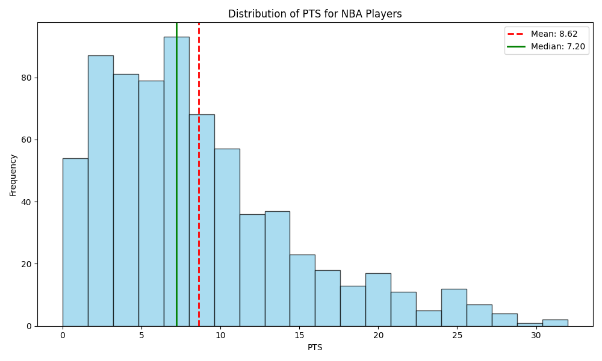
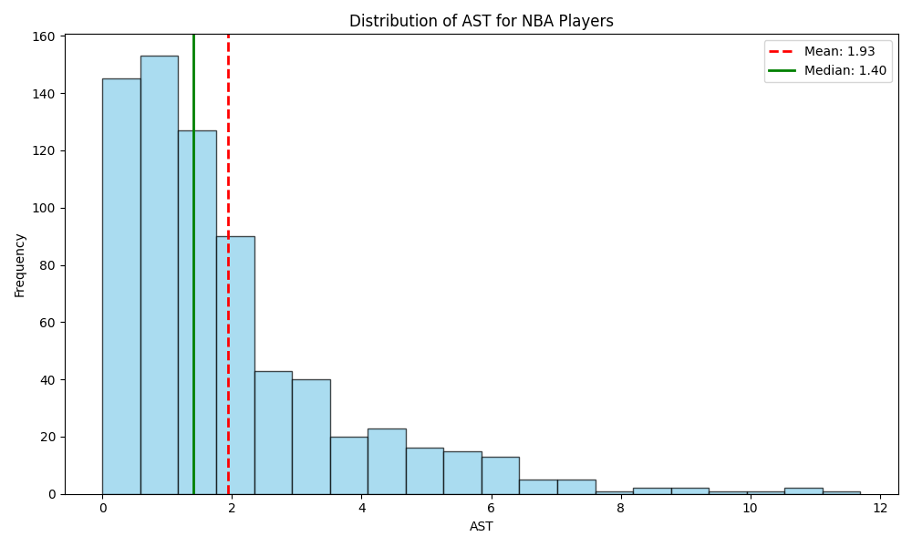
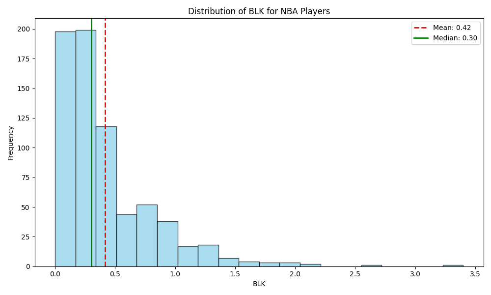

# IDS706_individual_project_1

## Requirements
* The project structure must include the following files:
    - Python script using Polars for descriptive statistics
    - Read a dataset (CSV or Excel)
    - Generate summary statistics (mean, median, standard deviation)
    - Create at least one data visualization

## Brief Introduction

### Dataset

#### [`NBA_2021.csv`](NBA_2021.csv)
This is the NBA 2021 global statistics table, which includes data for every player, such as PT (points), BL (blocks), and AT (assists).

### Python Scripts

In [`src/main.py`](src/main.py), This main.py script is used to read data from a CSV file, perform statistical analysis, and generate a data report. The script will generate three images and a PDF report. The three images are histograms showing the distribution of points, assists, and blocks for all players. Additionally, a PDF file with the report will be generated [here](NBA_2021_Report.pdf).

#### Descriptive Statistics

In [`src/main.py`](src/main.py), function `statistics()` will generate descriptive of the dataset, the output looks like:

- [Click here to find out what each column represents](https://www.nba.com/stats/help/glossary#pctfga)

| Index | Player              | Pos | Age | Tm  | G   | GS  | MP   | FG  | FGA  | FG%   | ... | FT%  | ORB | DRB | TRB | AST | STL | BLK | TOV | PF  | PTS  |
|-------|---------------------|-----|-----|-----|-----|-----|------|-----|------|-------|-----|------|-----|-----|-----|-----|-----|-----|-----|-----|------|
| 0     | Precious Achiuwa    | PF  | 21  | MIA | 61  | 4   | 12.1 | 2.0 | 3.7  | 0.544 | ... | 0.509 | 1.2 | 2.2 | 3.4 | 0.5 | 0.3 | 0.5 | 0.7 | 1.5 | 5.0  |
| 1     | Jaylen Adams        | PG  | 24  | MIL | 7   | 0   | 2.6  | 0.1 | 1.1  | 0.125 | ... | NaN  | 0.0 | 0.4 | 0.4 | 0.3 | 0.0 | 0.0 | 0.0 | 0.1 | 0.3  |
| 2     | Steven Adams        | C   | 27  | NOP | 58  | 58  | 27.7 | 3.3 | 5.3  | 0.614 | ... | 0.444 | 3.7 | 5.2 | 8.9 | 1.9 | 0.9 | 0.7 | 1.3 | 1.9 | 7.6  |
| 3     | Bam Adebayo         | C   | 23  | MIA | 64  | 64  | 33.5 | 7.1 | 12.5 | 0.570 | ... | 0.799 | 2.2 | 6.7 | 9.0 | 5.4 | 1.2 | 1.0 | 2.6 | 2.3 | 18.7 |
| 4     | LaMarcus Aldridge   | C   | 35  | TOT | 26  | 23  | 25.9 | 5.4 | 11.4 | 0.473 | ... | 0.872 | 0.7 | 3.8 | 4.5 | 1.9 | 0.4 | 1.1 | 1.0 | 1.8 | 13.5 |
| ...   | ...                 | ... | ... | ... | ... | ... | ...  | ... | ...  | ...   | ... | ...  | ... | ... | ... | ... | ... | ... | ... | ... | ...  |
| 700   | Delon Wright        | PG  | 28  | SAC | 27  | 8   | 25.8 | 3.9 | 8.3  | 0.462 | ... | 0.833 | 1.0 | 2.9 | 3.9 | 3.6 | 1.6 | 0.4 | 1.3 | 1.1 | 10.0 |
| 701   | Thaddeus Young      | PF  | 32  | CHI | 68  | 23  | 24.3 | 5.4 | 9.7  | 0.559 | ... | 0.628 | 2.5 | 3.8 | 6.2 | 4.3 | 1.1 | 0.6 | 2.0 | 2.2 | 12.1 |
| 702   | Trae Young          | PG  | 22  | ATL | 63  | 63  | 33.7 | 7.7 | 17.7 | 0.438 | ... | 0.886 | 0.6 | 3.3 | 3.9 | 9.4 | 0.8 | 0.2 | 4.1 | 1.8 | 25.3 |
| 703   | Cody Zeller         | C   | 28  | CHO | 48  | 21  | 20.9 | 3.8 | 6.8  | 0.559 | ... | 0.714 | 2.5 | 4.4 | 6.8 | 1.8 | 0.6 | 0.4 | 1.1 | 2.5 | 9.4  |
| 704   | Ivica Zubac         | C   | 23  | LAC | 72  | 33  | 22.3 | 3.6 | 5.5  | 0.652 | ... | 0.789 | 2.6 | 4.6 | 7.2 | 1.3 | 0.3 | 0.9 | 1.1 | 2.6 | 9.0  |

#### points histogram

#### assists histogram

#### blocks histogram

### Tests

There are three kinds of tests in this project.

* [test_lib.py](src/test_lib.py): this script is used to test functions in lib.py which contains functions shared by [`main.py`](src/main.py) and [`python_ds_project_1.ipynb`](python_ds_project_1.ipynb)

* [test_main.py](src/test_main.py): this script is used to test main if it successfully generate three figures and one PDF report.

* [test_notebook.py](src/test_notebook.py): this script is used to test if the output of jupyter notebook is the same as the saved output.

## 🚀 Project Demo Video

Click the thumbnail below to watch the project demonstration video on YouTube:

